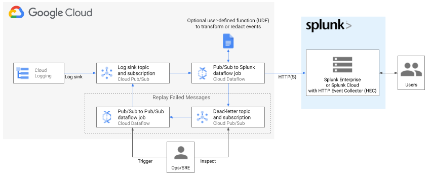

# Terraform templates for Google Cloud log export to Splunk

Terraform scripts for deploying log export to Splunk per Google Cloud reference guide:<br>
[Deploying production-ready log exports to Splunk using Dataflow](https://cloud.google.com/architecture/deploying-production-ready-log-exports-to-splunk-using-dataflow).

These deployment templates are provided as is, without warranty. See [Copyright & License](#copyright-&-license) below.

### Architecture Diagram



### Configurable Parameters

Parameter | Description 
--- | ---
project | The project to deploy to, if not set the default provider project is used
region | Region to deploy into (for regional resources)
zone | Zone to deploy into (for zonal resources)
create\_network | Boolean value if a new network needs to be created.
network | Network to deploy into
subnet | Subnet to deploy into. This is **required** when deploying into existing custom mode network
primary\_subnet\_cidr | The CIDR Range of the primary subnet
workspace | (Optional) Workspace to create Monitoring dashboard in. This assumes Workspace is already created and project is already added to it. If not specified, no dashboard will be created
log_filter | Log filter to use when exporting logs
splunk_hec_url | Splunk HEC URL to stream data to, e.g. https://[MY_SPLUNK_IP_OR_FQDN]:8088
splunk_hec_token | Splunk HEC token
dataflow_job_name | Dataflow job name. No spaces.
dataflow_job_machine_type | (Optional) Dataflow job worker machine type (default 'n1-standard-4')
dataflow_job_machine_count | (Optional) Dataflow job max worker count (default 2)
dataflow_job_parallelism | (Optional) Maximum parallel requests to Splunk (default 8)
dataflow_job_batch_count | (Optional) Batch count of messages in single request to Splunk (default 50)
dataflow_job_disable_certificate_validation | (Optional) Boolean to disable SSL certificate validation (default false)
dataflow_job_udf_gcs_path | (Optional) GCS path for JavaScript file (default No UDF used)
dataflow_job_udf_function_name | (Optional) Name of JavaScript function to be called (default No UDF used)
dataflow_template_path | (Optional) Dataflow template GCS path (default 'gs://dataflow-templates/latest/Cloud_PubSub_to_Splunk'). Override this for version pinning.

### Getting Started

#### Requirements
* Terraform 0.13+

#### Setup working directory

1. Copy placeholder vars file `variables.yaml` into new `terraform.tfvars` to hold your own settings.
2. Update placeholder values in `terraform.tfvars` to correspond to your GCP environment and desired settings. See [list of input parameters](#configurable-parameters) above.
3. Initialize Terraform working directory and download plugins by running:

```shell
$ terraform init
```

#### Deploy log export pipeline

```shell
$ terraform plan
$ terraform apply
```

#### View log export monitoring dashboard (applicable if Monitoring Workspace parameter was provided)

 1. Retrieve dashboard id from terraform output
```shell
$ terraform output dataflow_log_export_dashboad
```
  The output is of the form `"projects/{project_id_or_number}/dashboards/{dashboard_id}"`.
  
  Take note of dashboard_id value.

 2. Visit newly created Monitoring Dashboard in Cloud Console by replacing dashboard_id in the following URL: https://console.cloud.google.com/monitoring/dashboards/builder/{dashboard_id}


### Cleanup

To delete resources created by Terraform, run the following then confirm:
``` shell
$ terraform destroy
```

### TODOs

* Support KMS-encrypted HEC token
* Create replay pipeline
* Create secure network for self-contained setup if existing network is not provided
* ~~Add Cloud Monitoring dashboard~~


### Authors

* **Roy Arsan** - [rarsan](https://github.com/rarsan)
* **Nick Predey** - [npredey](https://github.com/npredey)


### Copyright & License

Copyright 2021 Google LLC

Terraform templates for Google Cloud Log Export to Splunk are licensed under the Apache license, v2.0. Details can be found in [LICENSE](./LICENSE) file.
